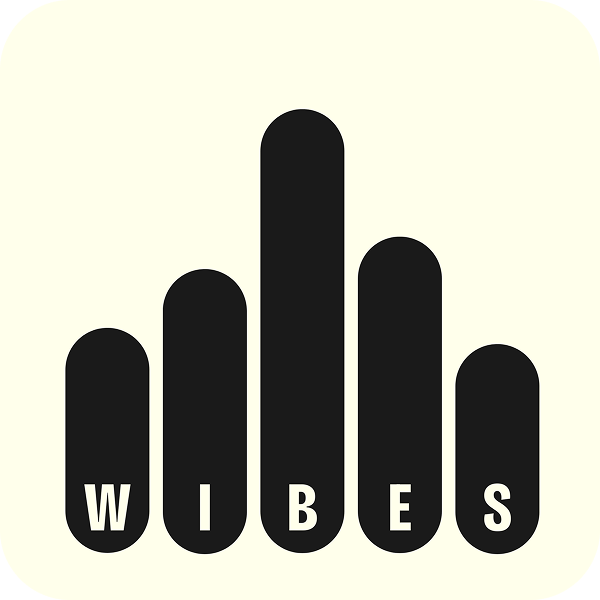

  

<h1 align="center">Wibe Stories</h1>

  <em>Turn your voice into shareable cards, in your language, in seconds.</em>

  No account · No install · 44 speech languages · 11 UI languages

  Independent project · Not affiliated with Wispr Flow

  <a href="https://wibestories.vercel.app"><strong>Live Demo →</strong></a>

  
  
  
  

---

<!-- TODO: replace this line with a screenshot of the card UI, e.g. assets/screenshots/hero.png -->

<em>Screenshot coming soon — capture the card editor and a finished card.</em>

## What is Wibe Stories?

Wibe Stories turns a short voice message — or typed text — into a designed, shareable card. Anyone opens the app, speaks or types something meaningful, picks a tone and colour, and gets a card they can download or send straight to WhatsApp, Instagram, iMessage, or X through the native share sheet.

No account, no install, no build step. The front end is plain HTML, CSS, and JavaScript; a few Vercel serverless functions handle speech-to-text fallback, AI tone rewriting, rate limiting, and shareable links.

**The idea:** voice tools are powerful but their output is invisible — dictation disappears into an email or a note, so nobody sees it and nobody discovers that speaking was an option. Wibe Stories makes one voice-created moment visible and shareable.

> Wibe Stories is an independent, unofficial project — not affiliated, not sponsored. [Wispr Flow](https://wisprflow.ai/r?BEST76) is credited in the page footer and shared-link previews; the cards themselves carry only the user's words and a small Wibe Stories mark.

## The grandparent test

> If a 70-year-old who only uses WhatsApp can open the app, speak a birthday message, and share the card in under 60 seconds — the app passes. If they cannot, it fails.

## How it works

1. **Open the app** — no login, install, or account.
2. **Speak or type** — tap Record and speak, or type / paste text.
3. **Choose your style** — pick a tone, card colour, and corner style.
4. **Create your card** — one tap to render the card.
5. **Share anywhere** — download the PNG, copy it, copy a link, or use the native share sheet.

## Features

- 🎙️ **Speak or type** — record your voice or just type
- ✨ **AI tone rewriting** — tap a tone (Warm, Bold, Poetic, Playful, Reflective, Honest) and your message is rewritten to match
- 🎨 **10 colour palettes** × 2 corner styles
- 🌍 **44 speech languages**, with the UI translated into 11 languages
- 🗓️ **53 auto-detected occasions** — birthdays, festivals, anniversaries, and more
- 📱 **Built for phones** — mobile-first, with native share
- 🌙 **Dark mode** — follows your system preference
- 🔒 **No accounts, no audio storage** — shared-link cards auto-expire after 36 hours

## Documentation

- **[Product documentation](documentation/WIBE_STORIES.md)** — product vision, features, design system, architecture, and roadmap.
- **[Developer guide](documentation/DEVELOPER.md)** — technical onboarding, code structure, deployment, and development workflow.
- **[API reference](documentation/API.md)** — all 19 serverless endpoints, request/response specs, and error codes.

## License

**All rights reserved.** This is a personal prototype, shared publicly for demonstration and evaluation only. No permission is granted to use, copy, modify, or redistribute the code — see [LICENSE](LICENSE). "Wibe Stories" is independent and not affiliated with Wispr Flow.

---

  Made with 🎙️ and ✨ · <a href="https://wibestories.vercel.app">wibestories.vercel.app</a>

